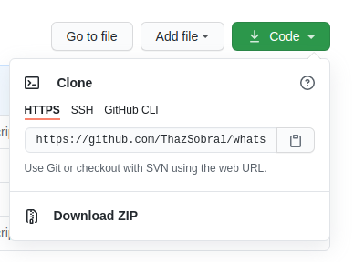
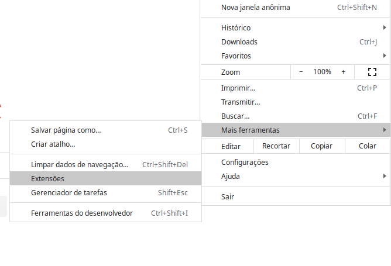
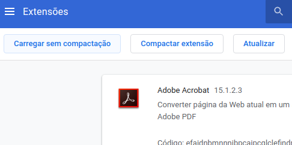
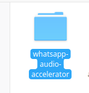
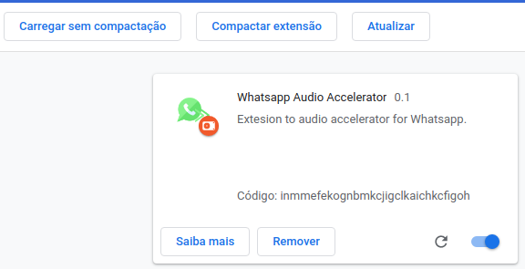

  

# whatsapp-audio-accelerator
> Esse projeto foi inspirado em um [vídeo](https://www.youtube.com/watch?v=j0Ih1xVyKbY&t=669s) do canal do [Programador-br](https://www.youtube.com/channel/UCrdgeUeCll2QKmqmihIgKBQ). A ideia é uma extensão do google chrome para acelerar audios do whatsapp e não perdermos mais aquele valisoso tempo com audios gingantescos.

> 

## Instalação local:

- faça o download em .zip ou clone o repositório,

- entre na configuração de extensões do Google Chrome,

- carregue a extensão sem compactação,

- selecione a pasta com os arquivos,

- verfique se a extensão está habilitada,

- agora é só economizar tempo quando for ouvir aqueles audios gigantescos. :thumbsup:

## Para contribuir:

Se deseja reportar algum erro ou sugerir alguma melhoria basta abrir uma issue.:wink:

> Conto com você para me ajudar a melhorar esse projeto!
